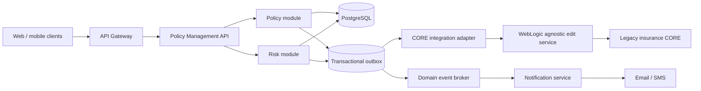

# Seguros Bolivar Policy Management Challenge

[](https://github.com/nicoceron/seguros-bolivar-challenge/actions/workflows/ci.yml)

A production-minded Spring Boot implementation of the rental-policy technical
assessment. It delivers every mandatory endpoint and rule, a resilient legacy-CORE
integration boundary, automated tests, and the complete five-module written response.

Repository: <https://github.com/nicoceron/seguros-bolivar-challenge>

## What is delivered

- Java 21 and Spring Boot 4.1 API with controller, service, and repository layers.
- `Poliza`/`Riesgo` domain model for `INDIVIDUAL` and `COLECTIVA` policies.
- Every required endpoint, filter, state transition, and validation.
- Mandatory `x-api-key` protection; local assessment value: `123456`.
- Atomic policy update plus transactional outbox event for the WebLogic/CORE adapter.
- Retry with bounded exponential backoff and a stable event ID for idempotent consumers.
- H2 zero-setup mode, PostgreSQL production-like mode, Flyway migrations, and demo data.
- RFC 9457-style errors, correlation IDs, OpenAPI UI, health checks, metrics, and logs.
- Unit/integration tests, JaCoCo coverage, Docker, Compose, and GitHub Actions CI.
- LaTeX source and final PDF answering all five modules.

The authoritative requirement register is [REQUIREMENTS.md](REQUIREMENTS.md).

## Architecture at a glance



For the assessment-sized implementation, Policy and Risk are modules inside one
deployable unit. This preserves local transactions and low operational overhead while
maintaining boundaries that can be extracted when independent scaling is justified.

The three selected patterns are:

1. **Modular monolith** - strong policy/risk boundaries without premature distributed
   transactions; extraction seams remain explicit.
2. **Hexagonal architecture** - the CORE dependency sits behind a port, so business rules
   are independent of HTTP/WebLogic details and easy to test.
3. **Event-driven integration with transactional outbox** - database mutations and CORE
   delivery intent commit atomically; temporary CORE downtime does not lose updates.

The full rationale, production topology, data model, failure modes, and scaling plan are
in [docs/technical-assessment.tex](docs/technical-assessment.tex).

## Run in under two minutes

### Option A - zero setup (H2)

Requirements: Java 21+ and Maven 3.9+.

```bash
mvn spring-boot:run
```

### Option B - PostgreSQL with Docker

```bash
docker compose up --build
```

In both modes:

- API: <http://localhost:8080>
- Swagger UI: <http://localhost:8080/swagger-ui.html>
- OpenAPI JSON: <http://localhost:8080/v3/api-docs>
- Health: <http://localhost:8080/actuator/health> (probe intentionally needs no key)
- Metrics: <http://localhost:8080/actuator/metrics> (requires the API key)

Two demo policies are loaded on an empty database: one individual and one collective.
Disable this with `DEMO_DATA_ENABLED=false`.

## Mandatory API contract

Every API call except the health probe requires:

```http
x-api-key: 123456
```

| Method | Path | Purpose |
|---|---|---|
| `GET` | `/polizas?tipo=COLECTIVA&estado=ACTIVA` | Filtered, paginated policy list |
| `GET` | `/polizas/{id}/riesgos` | Risks for a policy |
| `POST` | `/polizas/{id}/renovar` | Apply IPC, extend the term, mark `RENOVADA` |
| `POST` | `/polizas/{id}/cancelar` | Cancel policy and every risk |
| `POST` | `/polizas/{id}/riesgos` | Add risk only to `COLECTIVA` |
| `POST` | `/riesgos/{id}/cancelar` | Cancel one risk |
| `POST` | `/core-mock/evento` | Required CORE logging stub |

`POST /polizas` and `GET /polizas/{id}` are included to make the frontend journey and
manual evaluation self-contained.

### Try the required operations

List active collective policies:

```bash
curl -sS \
  -H 'x-api-key: 123456' \
  'http://localhost:8080/polizas?tipo=COLECTIVA&estado=ACTIVA'
```

Renew policy 1 by 5.2% IPC:

```bash
curl -sS -X POST \
  -H 'Content-Type: application/json' \
  -H 'x-api-key: 123456' \
  -d '{"ipcPercentage":5.20}' \
  http://localhost:8080/polizas/1/renovar
```

Add a risk to collective policy 2:

```bash
curl -sS -X POST \
  -H 'Content-Type: application/json' \
  -H 'x-api-key: 123456' \
  -d '{"propertyAddress":"Calle 80 # 10-20, Bogota","tenantName":"Laura Perez"}' \
  http://localhost:8080/polizas/2/riesgos
```

Exercise the exact mandatory CORE mock:

```bash
curl -i -X POST \
  -H 'Content-Type: application/json' \
  -H 'x-api-key: 123456' \
  -d '{"evento":"ACTUALIZACION","polizaId":555}' \
  http://localhost:8080/core-mock/evento
```

Create an individual policy:

```bash
curl -sS -X POST \
  -H 'Content-Type: application/json' \
  -H 'x-api-key: 123456' \
  -d '{
    "type":"INDIVIDUAL",
    "effectiveFrom":"2026-08-01",
    "durationMonths":12,
    "monthlyRent":1800000.00,
    "policyholderName":"Ana Torres",
    "beneficiaryName":"Carlos Ruiz",
    "risks":[{
      "propertyAddress":"Calle 72 # 10-20, Bogota",
      "tenantName":"Ana Torres"
    }]
  }' \
  http://localhost:8080/polizas
```

## Business behavior and assumptions

- Currency-like values use `BigDecimal` with two decimals and `HALF_UP` rounding.
- `premium = monthlyRent * initialDurationMonths` on creation.
- IPC is a percentage in the inclusive range `[0, 100]`. Renewal applies the same factor
  to rent and premium and opens a new term with the original duration.
- Individual policy creation requires exactly one risk. The add-risk endpoint is
  intentionally collective-only.
- Cancellation is a state transition, not physical deletion. Policy cancellation
  cascades to all risks in the same transaction.
- Every create/renew/cancel/add-risk mutation creates a CORE outbox record in that same
  transaction. Delivery is at-least-once; `eventId` gives the real CORE adapter an
  idempotency key.
- The literal key `123456` is retained only because the assessment mandates it. Deployed
  environments must provide `POLICY_API_KEY` from a secrets manager.

## Configuration

| Variable | Default | Meaning |
|---|---|---|
| `POLICY_API_KEY` | `123456` | Required request key |
| `SERVER_PORT` | `8080` | HTTP port |
| `CORE_BASE_URL` | `http://localhost:8080` | CORE/WebLogic adapter base URL |
| `CORE_DISPATCH_ENABLED` | `true` | Enables outbox delivery worker |
| `DEMO_DATA_ENABLED` | `true` | Loads two policies when the database is empty |
| `DATABASE_URL` | PostgreSQL local URL | JDBC URL in the `postgres` profile |
| `DATABASE_USERNAME` | `policies` | PostgreSQL user |
| `DATABASE_PASSWORD` | `policies` | PostgreSQL password |

## Quality gates

```bash
mvn verify
```

This compiles the Java 21 target, applies Flyway against H2, executes domain and
full-context MockMvc tests, and produces the JaCoCo report at
`target/site/jacoco/index.html`.

CI repeats the same command on every main/topic-branch push and pull request. The tests
cover all mandatory rules plus API-key rejection, filter semantics, CORE delivery intent,
and retry scheduling.

## Project structure

```text
src/main/java/com/segurosbolivar/policy
├── api/             REST controllers, DTOs, and problem responses
├── config/          API key, correlation, OpenAPI, and demo setup
├── domain/          Poliza/Riesgo entities and lifecycle invariants
├── integration/     CORE port, HTTP adapter, and outbox dispatcher
├── repository/      Spring Data repositories
└── service/         Transactional application use cases
```

## Submission artifacts

Build the LaTeX report:

```bash
make docs
```

Build the PDF and clean source ZIP with the required names:

```bash
make package
```

Artifacts are written to `output/` and are intentionally not committed.

